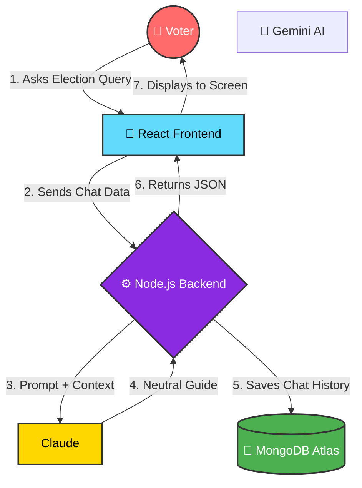

<div align="center">

# ElectraGuide 🇮🇳
**AI-Powered Election Process Assistant for India**

[](https://reactjs.org/)
[](https://www.anthropic.com/)
[](https://devpost.com)


*(Please replace this placeholder with a demo GIF)*

</div>

---

## 🚨 The Problem

India is the world's largest democracy, yet millions of young, eligible citizens fail to vote. **Why?**
* **Information Overload:** Government documents are written in complex legal jargon that alienates youth.
* **Voter Ignorance:** First-time voters (18–25) often don't know the step-by-step process of registration, the required documents, or what actually happens inside a polling booth.
* **Misinformation:** Political bias and fake news make it hard to find neutral, reliable, and straightforward civic education.

## 💡 The Solution

**ElectraGuide** is an interactive, strictly neutral AI assistant designed to demystify the Indian election process. In just a few conversational prompts, it transforms complex Election Commission guidelines into bite-sized, personalized, and engaging civic education for first-time voters.

## ✨ Key Features

* 🎯 **Personalized Onboarding** — Dynamically adjusts answers based on the user's age, state, and voting history.
* ✅ **Eligibility Checker** — Instantly verifies age and documentation requirements for Form 6 registration.
* 🏛️ **11-Stage Process Breakdown** — Explains everything from the Model Code of Conduct (MCC) to Government Formation in simple terms.
* 🗳️ **Booth Walkthrough** — A step-by-step guide to voting day (EVMs, VVPAT verification, and the indelible ink).
* 🗣️ **Bilingual Support** — Seamlessly mixes English with common Hindi election terms (e.g., *Matdata*, *Chunav*).
* ⚖️ **Zero Political Bias** — Hard-coded prompt guardrails ensure the AI informs without influencing.
* 🔗 **Official Integration** — Always directs users to the official `voters.eci.gov.in` portal.

## 🔄 How It Works

1. **User Opens App** 📱 
   * The user is greeted by a clean, welcoming chat interface.
2. **Answers Onboarding Questions** 💬 
   * The AI asks for the user's age, state, and if they are a first-time voter.
3. **Gets Personalized Guidance** 🗺️ 
   * The user receives a tailored, step-by-step checklist to get registered and ready for polling day!

### 🏗️ Architecture Flow



## 🛠️ Tech Stack

| Component | Technology | Description |
| :--- | :--- | :--- |
| **Frontend** | React (Vite) | Blazing fast, interactive UI built for mobile-first accessibility. |
| **Styling** | Tailwind CSS | Modern, responsive, and clean design system. |
| **AI Model** | Claude 3.5 Sonnet | `claude-sonnet-4-20250514` for highly intelligent, nuanced, and strictly neutral conversational logic. |
| **Backend API** | Node.js / Express | Lightweight server to securely manage API calls and state. |

## 🚀 Getting Started

To run ElectraGuide locally, follow these steps:

```bash
# 1. Clone the repository
git clone https://github.com/your-username/ElectraGuide.git
cd ElectraGuide

# 2. Install dependencies for both client and server
npm run install:all

# 3. Create your environment file
cp server/.env.example server/.env

# 4. Start the development servers (requires two terminals)
# Terminal 1:
npm run dev:server
# Terminal 2:
npm run dev:client
```

## 🔐 Environment Variables

Create a `.env` file in the `server` directory and add the following:

```env
ANTHROPIC_API_KEY=your_claude_api_key_here
PORT=8080
```

## 📁 Project Structure

```text
ElectraGuide/
├── client/                 # React Frontend
│   ├── src/
│   │   ├── components/     # UI Components (Chat UI, Bubbles)
│   │   ├── App.jsx         # Main Application Logic
│   │   └── index.css       # Tailwind Directives
│   ├── package.json
│   └── vite.config.js
├── server/                 # Node.js Backend
│   ├── routes/
│   │   └── chat.js         # Claude API Integration & Persona Logic
│   ├── index.js            # Express Server Setup
│   └── package.json
├── .gitignore
└── README.md
```

## 📸 Screenshots

<!-- Add screenshots here -->
*Add high-quality screenshots of the chat interface, onboarding flow, and voting walkthrough here.*

## 🏆 Hackathon Challenge

**Built for Challenge 2 — Election Process Education**
This project directly addresses the challenge prompt by gamifying and simplifying the civic education process, ensuring young Indians understand their rights and duties without wading through dense government documents.

## 🏅 Why ElectraGuide Wins

* **High Impact Target:** Directly targets the crucial 18–25 demographic, addressing the root cause of low youth voter turnout.
* **Unbreakable Neutrality:** Engineered with strict guardrails to prevent AI hallucination or political bias, making it safe for official deployment.
* **Hyper-Personalized:** Unlike static PDFs, the AI adapts to the user's specific state and age, making the information highly relevant.
* **Scalable Architecture:** Built on lightweight React and Node, it can easily handle massive traffic spikes during election seasons.

## 🌍 Impact & Vision

Our vision is to scale ElectraGuide to serve India's 950 million voters. Future iterations will include full multi-lingual voice support for regional languages, WhatsApp bot integration for rural accessibility, and direct API tie-ins with the Election Commission of India (ECI) for real-time polling booth data.

## 👥 Team

| Name | Role | GitHub |
| :--- | :--- | :--- |
| JyotiPrakash | Full Stack Developer | [@jp7107](https://github.com/jp7107) |  


## 📄 License

This project is licensed under the MIT License - see the LICENSE file for details.

---
<div align="center">
<b>Democracy thrives when its citizens are informed.</b> 🇮🇳
</div>
